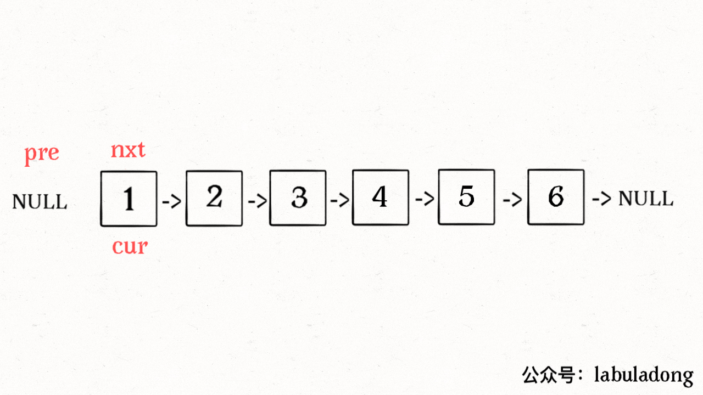
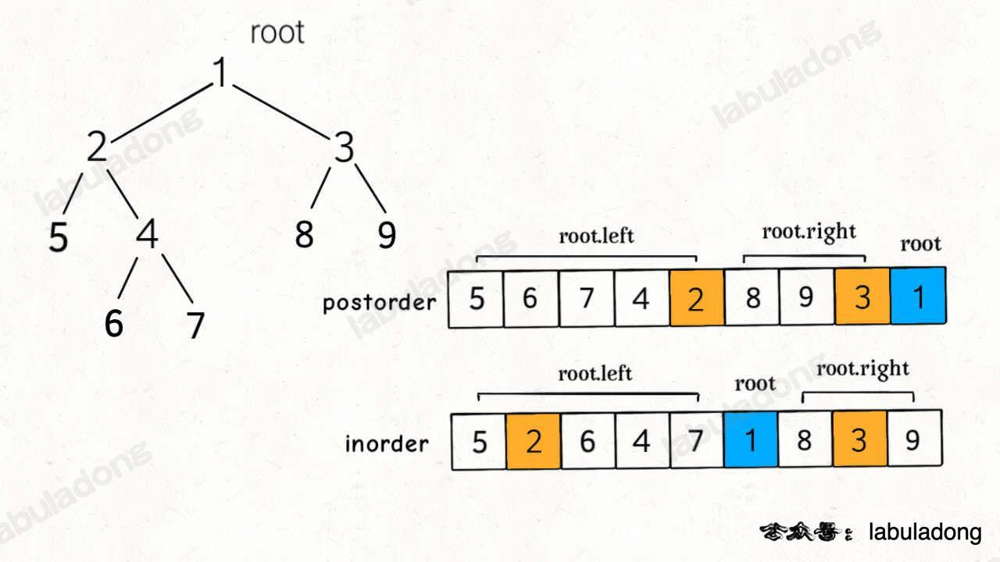

# 反转链表


```c++
    ListNode *reverse(ListNode *head) {
        if (!head) {
            return nullptr;
        }
        ListNode *pre = nullptr, *cur = head, *nxt = nullptr;
        for (cur = head; cur != nullptr;) {
            // nxt用于暂时保存cur->next
            nxt = cur->next;
            // 逐个节点反转
            cur->next = pre;
            // pre用于记录上次操作的节点
            pre = cur;
            cur = nxt;
        }
        return pre;
    }
```

# 根据中序遍历序列后续遍历序列构建二叉树

```c++
class Solution {
public:
    TreeNode *buildTree(vector<int> &inorder, vector<int> &postorder) {
        unordered_map<int, int> inMap;
        // inorder 和 postorder 都由 不同 的值组成
        for (int i = 0; i < inorder.size(); i++) {
            inMap[inorder[i]] = i;
        }
        return build(inorder, 0, inorder.size() - 1, postorder, 0, postorder.size() - 1, inMap);
    }

    TreeNode *build(vector<int> &inorder, int inStart, int inEnd, vector<int> &postorder, int postStart, int postEnd,
                    unordered_map<int, int> &inMap) {

        if (inStart > inEnd || postStart > postEnd) {
            return nullptr;
        }

        // 找根节点
        int rootVal = postorder[postEnd];
        // 得到左子树有几个节点，右子树有几个节点
        int inRootIndex = inMap.at(rootVal);
        int leftSize = inRootIndex - inStart;
        int rightSize = inEnd - inRootIndex;

        TreeNode *root = new TreeNode(rootVal);
        // 计算左子树inorder数组inStart,inEnd,左子树postorder数组postStart,postEnd

        // 构建左子树
        root->left = build(inorder, inStart, inRootIndex - 1, postorder, postStart, postStart + leftSize - 1, inMap);
        // 构建右子树
        root->right = build(inorder, inRootIndex + 1, inEnd, postorder, postStart + leftSize, postEnd - 1, inMap);
        return root;

    }
};
```